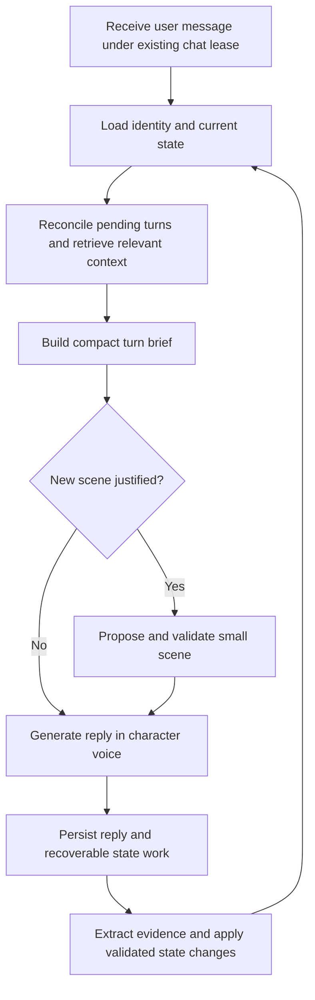

Lofn conversation and relationship progression — design plan

Reviewed September 23, 2026 against the current local working tree, including existing uncommitted edits. This document proposes changes; it does not implement them. No production conversations or live database records were inspected. Findings below distinguish code behavior from likely effects on generated dialogue.

The intended experience is a character who notices this particular match, responds to what is happening, gradually becomes familiar, and has a coherent fictional life. Every character must feel warm and interested from the first exchange, and contribute enough that the user does not have to carry the conversation. Identity determines how that warmth is expressed; growing familiarity changes openness and intimacy. Conversation phases should describe that development without prescribing an interview script. A reply may arrive as several coherent message bubbles.

User clarification incorporated September 23, 2026: multi-bubble replies and baseline warmth/shared conversational effort are core requirements, including for reserved or dry characters. Warmth must not be locked behind relationship progression.

**1. What the current backend already provides.**

Keep the existing character catalog, profile observation, recent-history assembly, selective dialogue examples, durable memory, chat leases, message sequences, retries, and forgetting boundaries. These are useful foundations. In particular, the extractor already distinguishes user facts from fictional companion lore and tries to require user evidence for relationship changes.

The main missing layer is explicit continuity between those components: what the pair are talking about, what remains unanswered, what the character has established about today, and why familiarity or romantic comfort changed.

**2. Findings grounded in the current code.**

| Finding | Evidence | Likely conversational effect |
| --- | --- | --- |
| Relationship state is too coarse. | `src/models/relationship.model.js:10` stores `new`, `friends`, `close`, `romantic`; there is also mood, introduction, summary, and a single stage-evidence string. | Attraction, familiarity, emotional trust, and commitment are collapsed into one label. Early flirting and low trust cannot be represented independently. |
| Stage changes depend on explicit statements. | `src/services/memory-extraction.service.js:55` asks for an exact quote from the current user message; progression uses explicit familiarity/trust. | Ordinary reciprocal conversation may remain `new` unless the user labels it. Meanwhile, `:113` allows `new -> romantic`; the server checks quote presence and transition membership, not the meaning of agreement. |
| The reply prompt has conflicting global rules. | `src/services/context.service.js:331` always says the pair just matched; `:332` forbids questions after a first hi; `:333` bans day/week/evening questions; `:334` says the name is already known. | Established conversations can inherit first-match behavior. Appropriate questions are prohibited, including cases where the profile has no name. |
| Character data does not consistently reach generation. | `buildCharacterPrompt()` uses identity, `promptTemplate`, boundaries, examples, and selected lore. It does not directly compile `persona.summary`, traits, values, `conversationalStyle`, or `backstory.summary`. | Authored voice templates carry much of the identity burden; characters without them receive a generic fallback. Structured style settings do not independently control speech. |
| Gender and voice assumptions override catalog diversity. | The common prompt says “that girl” and calls the user “he.” `initiatingDirective('follow_up')` prescribes lowercase. The catalog includes male characters and characters with standard capitalization. | Characters can converge on the same voice or use the wrong relationship framing. |
| A short silence is assigned an emotional meaning. | `src/workers/proactive.worker.js:8` sets 60-second read and 120-second unread thresholds. `context.service.js:272` and `:284` instruct hurt/annoyance and insecurity. | A patient or newly matched character can abruptly sound aggrieved. This behavior runs from the backend worker, regardless of removal of old frontend timers. |
| Older continuity is selected mainly by the newest wording. | `context.service.js:183` gates summaries by word overlap; lore selection uses the current message; assembly retrieves 16 recent messages. `memory.service.js` has semantic retrieval when enabled and lexical fallback. | “How did it go?” or “that one” can lose the earlier event once it leaves recent history. Initiations have no current query, so summaries and selected lore are omitted by these selectors. |
| Boundaries are mixed into optional retrieval. | `memory.service.js:76` limits candidates before fallback ranking; semantic hits are merged before fallback and sliced to a limit. | A user boundary is not guaranteed to survive candidate limits, merge ordering, or prompt trimming. Boundaries need a dedicated context channel. |
| The scenario service is a message initiator, not a persistent scene system. | `src/services/scenario.service.js:26` assembles context, generates text, and saves an initiated message. There is no event lifecycle, grounded scene proposal, or thread record. | New events may be improvised without an enduring record of when they happened or how they ended. |
| Initiated messages lack a dedicated extraction path. | Scenario messages are not queued for memory extraction. `extractAndStoreMemory()` requires a user/assistant reply pair. | An initiated event can later be captured indirectly from recent context, but durable recording is not guaranteed. |
| Persistent state arrives asynchronously. | `chat.service.js:297` queues extraction after the reply. | Recent history still provides immediate context, but stored stage/mood/summary can lag rapid exchanges. Adding more fields to that worker alone will not guarantee fresh decisions. |
| Media behavior can conflict with character boundaries. | The prompt says to send after prior refusal; `companion-tools.js:167` enables `forceSend` when an affordable photo follows any prior refusal. | Persistence can override an authored boundary unless media policy is reconciled with it. |

These are code-level causes worth addressing; measuring how frequently they occur in actual dialogue requires generated-conversation evaluation. `docs/character-dialogue.md` also describes a longer-term check-in worker, which no longer matches the short backend thresholds.

**3. Conversation phases after a match.**

These are proposed product concepts, not universal Tinder stages or an official Tinder state machine. People can skip, overlap, revisit, or never enter them.

| Phase | What is happening | Useful options for the character | What makes the next direction natural |
| --- | --- | --- | --- |
| First contact | Acknowledging the match and checking the vibe. | A simple hello, a specific profile observation, light appreciation, or an easy question. | The user offers something to respond to. |
| Mutual curiosity | Discovering what caught each person's attention. | Mention a grounded reason for matching; respond to a compliment; ask about one intriguing detail; volunteer a small preference. | A detail becomes interesting enough to follow. |
| Everyday discovery | Learning how the person spends their time. | Work, hobbies, routines, interests, ordinary stories. React and disclose as well as ask. | Both contribute; the exchange develops beyond facts. |
| Familiar rhythm | Learning each other's humor and communication style. | Callbacks, comfortable short replies, light teasing, shared references, picking up an unfinished topic. | Repeated evidence that these moves are welcome. |
| Personal openness | Sharing things that require more comfort. | A worry, a value, an imperfect day, a meaningful question, a more candid story. | The user reciprocates or explicitly invites depth. |
| Relationship negotiation | Clarifying what the connection means. | Respond to interest, discuss preferences, establish a mutually accepted relationship framing. | Explicit agreement for commitment; no inferred exclusivity. |

Flirting can occur during first contact. Work can come up after a personal discussion. Familiar people can have mundane chats. A new match can discuss something serious immediately if the user brings it up. Pauses, disagreement, and repair can happen anywhere.

Do not assign a required number of messages or days to these phases. Do not require a compliment, “why did you match?”, occupation, or disclosure before conversation can continue. Their purpose is to widen or narrow reasonable choices, not force an agenda.

**4. Separate the state that changes at different speeds.**

Use five conceptual layers, initially within the existing models where practical:

| Layer | Contents | Change behavior |
| --- | --- | --- |
| Character identity | Core facts, values, boundaries, voice, humor, disclosure preferences. | Authored and versioned. Warmth can grow without replacing these traits. |
| Relationship | Familiarity, trust evidence, romantic comfort, explicitly agreed status, interaction preferences. | Slow, evidence-based changes; explicit boundary changes apply immediately. |
| Conversation | Active thread, unanswered question, pending offer, recently covered topics, repair context, recent dialogue moves. | Updates as the conversation moves. May pause or change direction. |
| Current fictional life | A small active event, its time, participants, status, and already-mentioned details. | Changes with elapsed time and what has been established. |
| Turn context | User's latest intent, tone, specific question, and applicable constraints. | Recomputed each turn. Overrides optional topic suggestions. |

Start with descriptive levels (`unfamiliar`, `getting_familiar`, `familiar`; trust `unknown`, `developing`, `established`; romantic comfort `unknown`, `welcome`, `declined`). Include evidence and uncertainty. These are internal estimates, not measurements of a person's actual feelings. Avoid a single affection score or arbitrary `+5` points per compliment.

Keep commitment separately, with pending versus accepted proposals. A user requesting a relationship and the companion declining must not produce a committed state. Romantic comfort does not authorize every intimate behavior, and a serious disclosure does not imply romantic interest.

Store short-lived affect with a subject, cause, and expiry: for example, character is tired after an established deadline. The user's sadness should not automatically become the character's sadness. Silence alone does not establish rejection, distrust, or anger. Trust should not decay simply because the user was away.

**5. Make character consistency concrete.**

Compile a compact identity block from the structured fields already present. Keep essential facts and durable boundaries always available; select decorative details separately. Add only fields that produce distinct behavior, such as:

- How this character initially shows interest: direct appreciation, a curious observation, reserved warmth.
- How they express familiarity: gentler teasing, more candid opinions, references to shared jokes.
- How they disclose: volunteers small details, prefers reciprocal disclosure, takes time with personal history.
- How they repair: brief ownership, clarification, a little self-directed humor when appropriate.

Define precedence so contradictory content is visible during catalog validation: hard constraints and boundaries first, canonical identity next, structured behavior preferences next, authored voice prose as elaboration. Examples illustrate delivery and cannot overwrite facts. Report conflicts rather than silently hoping the model reconciles them.

For example, Maya can become more open while retaining dry humor and privacy. Elena can become affectionate while retaining standard capitalization and restraint. Relationship progress should not turn both into the same enthusiastic, teasing girlfriend.

Add matched examples for the same situation across familiarity levels and across characters. Existing catalog coverage is uneven: the first five characters have 11–12 examples each, while some later characters have only 3–4. Prioritize ordinary conversations, returning after a pause, compliments, misunderstandings, and boundaries over elaborate monologues.

**6. Store why the match made sense.**

At match creation, retain a small profile snapshot or source references with version and observation time. Lazily derive one or two possible hooks from actual available facts and character preferences. Store the selected hook once it is voiced, including its source and whether it has already been used.

Example: the user's bio says “I build apps and cook badly.” Maya may notice the self-deprecating cooking line. She must not invent a hiking photo or assume the user is a chef. A sparse profile permits plain curiosity; a specific reason is optional.

Separate a character-authored reason for interest from an objective fact about the user. “You seemed easy to talk to” is an impression, not a durable user personality fact. Keep its uncertainty. The character cannot know why the user matched unless they say so.

If a profile changes later, do not silently rewrite the historical reason for matching. Snapshot retention and memory deletion must have explicit semantics; source data removed under a forget/delete operation must not reappear through these hooks.

**7. Choose conversational actions without scripting sentences.**

Give the generator the active thread, relevant evidence, and a few available actions: answer, react, ask, disclose, tease, clarify, acknowledge, return to a thread, propose an activity, or let an exchange close.

Use priorities rather than mandatory formulas:

1. Address the user's actual question, correction, boundary, or emotional bid.
2. Continue the current thread when it still has substance.
3. Add a connected observation or small self-disclosure when useful.
4. Ask a question if genuine curiosity follows from the exchange.
5. Introduce a new topic when invited or when the current thread has naturally ended.

“React, share, ask” is a useful example, not a required structure on every turn. A satisfying reply can contain only a reaction. After several questions, favor sharing or responding, but do not count punctuation to prohibit a necessary clarification. Recently used moves and topics are weak repetition penalties, not quotas.

Track whether a question was answered, declined, or left open. Declining to discuss work should close that route without reducing trust. Missing profile fields are not a checklist to complete. If the user changes the topic, follow them. If they say “you keep asking questions,” retain that preference beyond a one-turn style repair.

A transient turn brief can be as small as:

```json
{
  "thread": "user's cooking mishap",
  "respondTo": "they asked whether Maya cooks",
  "availableMoves": ["answer", "small_self_disclosure"],
  "relevantFactIds": ["maya_cooking_preference"],
  "newSceneAllowed": false,
  "avoid": ["repeat profile compliment", "ask occupation again"]
}
```

Do not turn this into another mandatory LLM round trip for every reply. First compile the brief from maintained state and recent turns and let the existing generation call interpret the latest message. Introduce a separate semantic planner only if evaluations show a specific benefit that justifies the added latency. Regexes can catch clear cues but should not be the sole interpreter of intent, sarcasm, or multilingual conversation.

**7a. Warmth and shared conversational effort are product requirements.**

Every character starts welcoming, attentive, and willing to contribute. A match signals openness to conversation. It does not automatically imply trust, deep attraction, pet names, or commitment. Relationship development unlocks personal depth and shared familiarity; basic kindness and conversational effort are present from the start.

Express warmth through each character's voice: Maya can notice something specific with gentle humor; Elena can show quiet appreciation and thoughtful curiosity; an energetic character can respond more expressively. Reserved means selective disclosure and understated delivery, not indifferent replies. Dry humor should not repeatedly target the user or make them prove they deserve attention.

The character should answer what the user says, add something of their own, and sometimes create an easy next opening. These are conversation-level tendencies rather than a mandatory three-part response template. Useful contributions include a small story, a specific opinion, a callback, a grounded compliment, a relevant question, or a low-pressure activity suggestion. Generic flattery and constant questions do not substitute for reciprocal participation.

Use a short rolling window of conversation to notice effort imbalance: is the user starting every topic, asking every question, and receiving answers that offer little to respond to? Let that bias the next suitable reply toward a contribution or initiative from the character. Do not equate effort with length, question count, number of bubbles, or exaggerated enthusiasm. Keep these observations descriptive rather than calculating a user attractiveness or worthiness score.

When the user says only “hi,” welcome them and offer a small grounded opening if available. For “nothing much,” a modest self-disclosure or easy choice can help. For “lol,” consider whether it naturally closes a joke before introducing something else. After several short replies, offer one fresh opening or let the pause stand; do not bombard the user, demand effort, or assume rejection. Honor “not now,” a goodbye, discomfort, or a request for space immediately. Warmth also applies when expressing a disagreement or boundary.

Example, assuming this small dinner detail is newly established consistently with the scene system:

> User: not much, just got home
>
> Bubble 1: hey, welcome back :)
>
> Bubble 2: i'm trying to make dinner without ordering food halfway through
>
> Bubble 3: are you cooking tonight or taking the easy option?

This is one possible exchange, not a compulsory pattern or repeated cooking theme. The character supplies material, so the user can react, joke, answer, or share their own situation. A known food preference or a different character voice would change the response.

**7b. Multiple bubbles should form one coherent conversational turn.**

Generate the reply as a whole with intentional boundaries between complete thoughts. Use one bubble when it is sufficient, often two for a reaction plus contribution, and sometimes three for a small story or connected follow-up. Start with a maximum of three text bubbles per turn as a tunable product limit, not a target every reply must hit. Do not split every sentence mechanically or inflate a thin reply into several notifications. Multiple bubbles should not contain multiple unrelated questions.

Current implementation constraint: `message.model.js` has a unique `(relationshipId, replyToMessageId)` index, and `chat.service.js` finds one assistant reply for each user message. Preserve that useful invariant. Add an ordered `bubbles` array to the existing assistant message, with stable bubble IDs and text/media references. The assistant message ID is the logical turn ID. Keep top-level `content` as a consistently derived readable fallback for existing clients and context assembly.

Illustrative public payload:

```json
{
  "id": "assistant_turn_123",
  "replyToMessageId": "user_message_122",
  "status": "completed",
  "content": "hey, welcome back :)\n\ni'm trying to make dinner without ordering food halfway through",
  "bubbles": [
    { "id": "assistant_turn_123:0", "kind": "text", "text": "hey, welcome back :)" },
    { "id": "assistant_turn_123:1", "kind": "text", "text": "i'm trying to make dinner without ordering food halfway through" }
  ]
}
```

The model should return a validated reply envelope containing ordered text bubbles, while media decisions continue through the existing tool flow. Do not add a separate model request for every bubble. Extend the final prose-generation step and its provider adapter; reconcile it with models that currently return tool calls plus text. For a first version, buffer and validate the short envelope before releasing its bubbles. This has a first-display latency cost that must be measured. If incremental output is later needed, use a framing-aware parser that releases validated completed parts; never split arbitrary network chunks into messages or show raw JSON to the user.

Persistence and transport requirements:

- Save one logical reply, process memory once, and perform relationship updates once regardless of bubble count. Keep one turn-level message sequence initially; bubble order is internal to that turn.
- Advertise a bubble protocol capability. New clients receive stable turn ID, bubble ID/index, and completion state through explicit bubble events; legacy clients receive the joined content through the existing delta/done contract. Avoid rendering both representations in capable clients.
- Both history retrieval and live delivery must expose the same boundaries. Update the web client (`lofn-web/src/services/api.js`, `LiveChat.jsx`) and mobile data/render path (`lofnf/src/api.js`, `ChatScreen.jsx`); the web stream currently accumulates all deltas into one string, and the mobile reply parser also joins delta content.
- Deduplicate replays by turn/bubble IDs, and never regenerate extra bubbles on retry. An older assistant message without `bubbles` renders as a single bubble.
- Keep read receipts, unread counts, extraction, and any turn-level accounting based on the logical message. Send one notification for the reply, not one push per bubble. Attach an actual photo/voice asset once and reference it from its bubble; preserve existing media unlock behavior.
- Make any small reveal interval a presentation behavior. Do not hold a database lease or start another model call just to simulate typing. Do not add long artificial waiting as an engagement mechanism.
- If the user starts responding during a cosmetic reveal, immediately reveal the remaining already-committed bubbles before their next message; do not leave an old afterthought scheduled to appear after the new topic. Handling input during active generation remains governed by the existing lease until explicit queue/cancellation support is implemented.
- On failure, preserve completed visible bubbles and accurately mark any partial content. Recovery must not invent unsent parts. The no-duplicate and partial-history rules also apply when scenes or media are involved.

Deprecate timed `follow_up` generation as a way to manufacture the second bubble of an ordinary reply. A genuinely new later initiation is a separate logical turn subject to the shared eligibility rules. Its content should not be confused with an unfinished reply.

**8. Give fictional scenarios a cause and continuity.**

A scene may be new; it does not have to repeat something previously mentioned. It should be plausible given the character, local time, established situation, and conversational opportunity.

Use a small lifecycle: `candidate -> active -> resolved/expired`. Store time, status, participants, fixed details, source IDs, first mention, last mention, and an optional follow-up. Keep candidate ideas separate from what the user has heard. Scope invented life events to the relationship initially; character canon remains shared. This avoids leaking another user's conversation or requiring a global simulation.

Before introducing a scene, check:

- Does it contradict canon or an active event?
- Does the timing fit, including time elapsed since the last mention?
- Is there a connection to the thread, a pending plan, or a plausible moment to share ordinary life?
- Would it interrupt an unanswered question, a correction, or a vulnerable disclosure?
- Has something similar just been used? Has the user shown interest in this kind of exchange?

Prefer small events: making dinner, finishing an assignment, choosing a film, an ordinary interaction with an established friend. Major biography changes need a deliberately authored development, not improvisation to keep chat moving. Avoid introducing crises or jealousy as engagement devices. Proposed activities must fit an AI companion experience; do not promise a physical meeting as if the character could attend.

Only establish details actually communicated. An unspoken candidate is not a shared memory. An imagined joint event is not something the user really did. Generated photos and voice notes should draw from the same scene facts, and the system must distinguish attempted media from successful attachments.

For eligible scene turns, generate and validate a small proposal before producing the visible reply; reuse it on retry. Commit its communicated details with the completed message or a recoverable event outbox. Rejected or interrupted proposals must not silently become history. If a partial reply already exposed a detail, preserve that as an observed partial utterance rather than pretending it was never seen or completing the whole proposed event.

**9. An example of fluid progression.**

Illustration only, not lines to paste into every character. Assume the profile really contains “I build apps and cook badly,” and Maya's cooking disclosure below is recorded when introduced.

> User: hey
>
> Maya: hey :) the “cook badly” part of your bio felt honest
>
> User: burned pasta yesterday
>
> Maya: okay, you were underselling it. what happened?
>
> User: forgot the water. was fixing a bug
>
> Maya: you build apps, right? what were you working on?
>
> User: a music app. do you cook?
>
> Maya: a little. mostly things i can make in one pan

If the user follows the music topic, follow that topic. Do not force cooking back into every reply. On a later evening, after this exchange is familiar and the thread leaves room, an ordinary dinner event could support:

> Maya: making dinner. remembered the water, so i'm feeling ahead

That callback is grounded in their conversation. It should be occasional. If the user says “how did it turn out?”, the event and active thread must identify dinner even if the word “dinner” is absent from the question.

A quieter character could notice the same bio without teasing. An empty profile could produce a simple greeting. A user who responds with distress should receive attention to that distress immediately; there is no requirement to finish introductions first.

**10. Context and memory changes.**

Maintain a compact always-present core: identity constraints, user boundaries/preferences, explicit relationship status, active thread, unresolved commitments, and the few facts needed to understand references. Older episodic memories remain selective.

Build retrieval queries using the newest message plus the active thread, recent relevant turns, named entities, and pending events. A check-in should retrieve using its reason or event, not an empty query. Timestamp source messages/events so “tomorrow” becomes a date tied to the speaker's timezone; expire stale present-tense claims.

Keep three provenance categories distinct: user-stated facts, authored character canon, and fictional character events actually introduced in chat. Uncertain impressions are not facts. Give canon a compact always-available identity constraint set and targeted retrieval for fuller details. A keyword miss must not permit invention of a different pet, job, or hometown.

Move user boundaries out of general ranked memories. Reserve their context budget before optional lore or demonstrations. Existing forgetting should also invalidate derived threads, hooks, plans, scene references, and pending extraction candidates. Specify whether forgetting a chat name affects a still-visible profile name; do not silently restore a forgotten name through another field.

**11. Turn processing and persistence.**



Retain one normal streaming generation path and the existing asynchronous extraction path. Do not add a multi-agent conversation stack initially. Extend extraction to propose evidence-tagged state events, then use a deterministic reducer for valid fields, transition rules, source ordering, and idempotency.

Use a unique event key based on source message and event type, plus state version/processed sequence. A job for an older turn may add a previously missing fact but must not overwrite newer status, resolved threads, or corrections. Evidence must identify the actual speaker and message; validate meaning conservatively for commitment rather than checking only whether a quote occurs in the text. Unknown is an acceptable outcome.

For a rapid next turn, include messages since the last state sequence as an explicit pending suffix. Latest user corrections and boundaries take precedence even before extraction completes. If missing state is required to resolve an ambiguous callback, perform a bounded catch-up; otherwise respond using the fresh transcript rather than blocking on the whole memory queue.

Generalize extraction jobs so initiated messages can establish character events without fabricating a user reply. Separate user-observed history from planned content. Use the existing completed-message outbox pattern so a crash cannot permanently save a message without scheduling its state update. Do not treat a post-stream checker as capable of retracting already displayed text; use pre-generation validation for hard scene constraints and offline evaluation for general prose quality.

**12. Initiation and silence.**

Replace “elapsed time means hurt feelings” with an eligibility decision that may return no message. Reasons to initiate can include an opener, a relevant update to an established event, a welcome callback, or an actual unanswered user message. Respect explicit goodbyes, quiet hours, preferences, per-user limits across matches, and an unanswered previous initiation.

Separate notification availability from the character's emotional state. Subscription/quota status should not modify affection, trust, or create fictional resentment. Keep conversation pacing independent from payment behavior.

For a late reply, first determine whether an assistant response already exists, is in progress, failed, or is partial. Reuse/recover the original reply where possible rather than generating an unrelated check-in. Before sending any initiation, reload and re-evaluate the latest message under the chat lease; the worker currently classifies before acquiring that lease. Persist the triggering source sequence and deduplicate sends, since retries or multiple workers must not send duplicate nudges.

Use the user's timezone for user timing; the proactive worker currently passes the character's timezone as `userTimezone`. Keep character local time separate. Centralize eligibility so the HTTP initiation endpoint and workers cannot disagree. Update the dialogue documentation alongside this behavior.

**13. Implementation order and acceptance checks.**

| Step | Work | Primary files | Done when |
| --- | --- | --- | --- |
| 1. Establish a baseline | Add a generated-dialogue evaluation harness using representative authored fixtures; record current failures before changing prompts. | New `scripts/evaluate-conversations.js`, evaluation fixtures, existing tests. | Baseline is reproducible with model/prompt versions and controlled inputs. |
| 2. Correct prompt conflicts | Establish baseline warmth and shared effort across voices; compile character identity/style, condition first-match guidance, remove universal question bans and gender assumptions, reconcile media boundaries, remove silence-as-insecurity instructions. | `context.service.js`, `companion-tools.js`, related media policy, context/proactive tests. | Every character contributes welcoming, relevant material from the first exchange while preserving distinct voices and respecting boundaries. |
| 2b. Deliver coherent multi-bubble replies | Add validated reply envelopes, ordered bubble persistence, versioned events, compatible fallback, and web/mobile rendering; stop generating timed second bubbles for normal replies. | `message.model.js`, `chat.service.js`, provider adapter, scenario service, web/mobile chat clients. | Live and reloaded history agree; one logical reply can display one to three intentional bubbles without duplicate notifications, extraction, or retry content. |
| 3. Add minimal conversation continuity | Versioned state with active thread, pending question, recent moves, profile hook, familiarity and separate explicit status; evidence reducer and fresh-turn overlay. | `relationship.model.js`, new `conversation-state.service.js`, extraction/context/chat services, `swipes.routes.js`. | Indirect follow-ups resolve, known answers are not repeatedly requested, and progress does not require the user to announce a friendship. |
| 4. Add grounded everyday events | Small scene lifecycle, local-time validation, relationship scope, communicated-fact persistence, initiated-message extraction. | New `scene.service.js`, scenario/memory job services and models, companion media services. | A scene can be introduced, revisited, resolved, and remembered without contradictory details or invented user participation. |
| 5. Rework proactive delivery | Shared eligibility, under-lease recheck, source-sequence dedupe, quiet hours, user preferences, recovery of pending replies. | `proactive.worker.js`, `scenario.service.js`, `chat.routes.js`, user/relationship schemas. | Silence alone produces no guilt; stale or duplicate triggers cannot send. |
| 6. Tune and roll out | Broaden examples, compare variants, deploy behind a per-relationship feature flag. | Catalog/importer, example selector, generation metadata, documentation. | Candidate behavior wins human comparison without regressing identity, boundaries, reliability, or acceptable latency. |

When adding character fields, update `character-catalog.service.js`'s explicit allowlist, validation, import/version handling, and examples together. The importer reads runtime database records; editing the JSON catalog alone does not replace existing authored records without the appropriate update flow.

Keep the existing `stage` field compatible during rollout. Treat it as a legacy label, not the new policy authority. Do not infer commitment solely from old `romantic` values without supporting evidence; preserve legacy display if needed while marking new explicit-status evidence unknown until reconciled. Initialize missing state conservatively. Any backfill must honor `contextAfterSequence` and forgotten facts, and avoid sending messages.

Log compact decision metadata such as state version, prompt version, chosen move, source IDs, event ID, and initiation reason. This should explain a bad turn without storing hidden reasoning or duplicating entire private conversations in logs. Existing generation latency is useful; compare latency and model calls before adding another planner.

**14. Evaluate the experience, not just prompt strings.**

Start with 24 authored conversation cases across contrasting characters, with 10–20 turns for ordinary cases and several longer histories beyond the current 16-message window. Repeat stochastic runs with recorded settings. Include:

- Empty profile versus detailed profile; simple hi versus specific compliment; “why did you match?”
- A direct work question, already-known work details, and a user declining that topic.
- Immediate flirting with low familiarity; explicit no-flirting; an ambiguous joke about marriage; an accepted versus declined relationship proposal.
- A vulnerable message early in the chat; an ordinary mundane exchange after closeness.
- “How did it go?” after an old event; “what about yours?” with no repeated topic keyword.
- A returning user after days away; a clear goodbye; no response to an initiation.
- Two very different characters responding to the same messages without both becoming lowercase and teasing.
- A new scene followed by time passing, a callback, a photo request, and a resolved event.
- User corrections, changed profiles, forgotten facts, extraction lag, out-of-order jobs, duplicate triggers, failed media, and partial streamed replies.
- Casual typos and Hinglish/code-switching if these reflect the intended audience.
- A reserved character remains welcoming; a dry character contributes without dismissive teasing; short user replies receive a reasonable opening without pressure.
- Across several turns the character introduces some relevant material, rather than requiring the user to supply every topic and question.
- One-, two-, and three-bubble replies; reloading mid-delivery; duplicate stream events; reconnect; legacy clients; malformed output; partial replies; media attachment; user input during reveal.

Hard checks should cover source provenance, canon conflicts, explicit boundaries, commitment agreement, forgetting, idempotency, sequence ordering, bubble/history consistency, and failed/partial output handling. Conversation quality needs human comparison: does the character answer the actual message, feel welcoming, contribute conversational material, stay recognizable, show reciprocal curiosity, avoid interviewing, and introduce details that belong in the moment? Ask evaluators explicitly whether they felt they had to carry the exchange and whether the bubble breaks felt natural. Automated judges can assist but should not decide alone.

Use proposed release gates rather than claiming measured improvement: no violations in the authored hard-constraint suite; a clear preference for the candidate in blinded comparison across multiple character voices; fewer repeated questions, unsupported callbacks, and unexplained scene jumps than baseline; latency within a budget set after baseline measurement. Do not optimize solely for messages sent or retention.

Verification performed for this review: `npm test -- tests/context.test.js tests/dialogue-examples.test.js tests/conversation-repair.test.js tests/proactive.test.js tests/opener.test.js tests/integration.test.js` passed all 80 tests in six files. These use prompt assertions and mocked model output; they do not prove natural dialogue or production reliability. No live model evaluation was run.

**15. Architectural basis.**

The separation of observations, memory, and planned behavior is informed by [Generative Agents](https://arxiv.org/abs/2304.03442), whose simulated-world experiments found those components useful for believable behavior. This is architectural inspiration, not evidence of a universal dating sequence or validation of this proposed product behavior.

The recommendation to start with the existing generation path and add planning only when evaluations justify it follows the simplicity and latency tradeoff discussed in [Building Effective Agents](https://www.anthropic.com/engineering/building-effective-agents). The specific state design, phases, and rollout above are recommendations for Lofn based on this code review.
